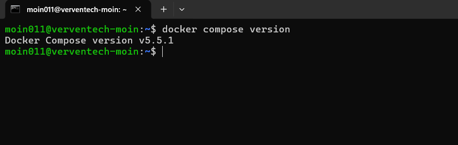
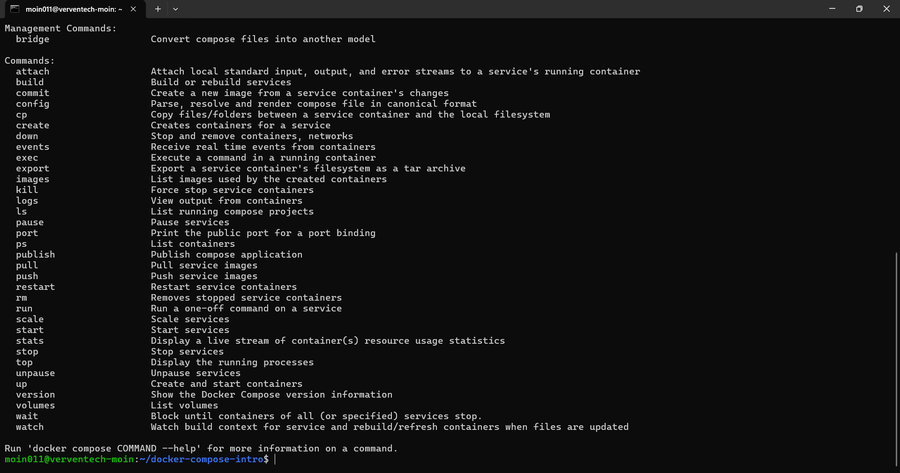

# Docker Compose Introduction

## Overview

Docker Compose is a tool used to define and manage multi-container Docker applications.

Instead of creating and configuring each container manually, Docker Compose allows multiple services, networks, volumes, environment variables, and dependencies to be defined in a single YAML file.

The configuration is usually stored in:

```text
docker-compose.yml
```

With Docker Compose, an entire application stack can be started, stopped, rebuilt, and managed using simple commands.

---

## Why Use Docker Compose?

A real-world application often requires multiple components.

For example:

```text
Web Application
      |
      v
   Database
```

Without Docker Compose, each container would have to be created and configured separately.

Docker Compose allows these components to be defined together:

```text
             Docker Compose
                   |
        +----------+----------+
        |                     |
        v                     v
   Web Container       Database Container
        |                     |
        +------ Network -------+
```

This makes multi-container applications easier to configure, reproduce, and manage.

---

# Installing Docker Compose

On Ubuntu, Docker Compose can be installed using the Docker Compose plugin:

```bash
sudo apt update
sudo apt install docker-compose-plugin
```

After installation, verify that Docker Compose is available:

```bash
docker compose version
```

Example output:

```text
Docker Compose version v5.5.1
```

## Screenshot — Docker Compose Version



> Modern Docker installations use the `docker compose` command as a Docker CLI plugin. The older `docker-compose` command with a hyphen is a legacy form.

---

# Docker Compose YAML File

Docker Compose uses a YAML configuration file to define application services.

The commonly used filename is:

```text
docker-compose.yml
```

A simple example:

```yaml
services:

  web:
    image: nginx:alpine
    ports:
      - "8080:80"

  database:
    image: postgres:15
    environment:
      POSTGRES_DB: appdb
      POSTGRES_USER: appuser
      POSTGRES_PASSWORD: password
```

This example defines two services:

- `web`
- `database`

The `web` service uses Nginx, while the `database` service uses PostgreSQL.

## Screenshot — Docker Compose YAML


---

# YAML Structure

A Docker Compose file generally follows this structure:

```yaml
services:

  service-name:
    image: image-name
    ports:
      - "host-port:container-port"
    environment:
      - VARIABLE=value
    volumes:
      - volume-name:/container/path
    networks:
      - network-name
    depends_on:
      - another-service

volumes:
  volume-name:

networks:
  network-name:
```

YAML indentation is important because it defines the relationship between configuration options.

The main sections are:

- `services`
- `volumes`
- `networks`

---

# Important Docker Compose Keywords

## 1. `services`

The `services` section defines the containers that make up the application.

Example:

```yaml
services:

  web:
    image: nginx:alpine

  database:
    image: postgres:15
```

Here:

```text
web       → Nginx service
database  → PostgreSQL service
```

Each service can have its own configuration.

---

## 2. `image`

The `image` keyword specifies the Docker image that should be used for a service.

Example:

```yaml
image: nginx:alpine
```

Another example:

```yaml
image: postgres:15
```

Docker pulls the image if it is not already available locally.

---

## 3. `build`

The `build` keyword is used when a service needs to be built from a `Dockerfile`.

Example:

```yaml
build:
  context: .
  dockerfile: Dockerfile
```

Here:

- `context: .` uses the current directory as the build context.
- `dockerfile: Dockerfile` specifies the Dockerfile to use.

---

## 4. `ports`

The `ports` keyword maps a host port to a container port.

Example:

```yaml
ports:
  - "8080:80"
```

The format is:

```text
HOST_PORT:CONTAINER_PORT
```

Therefore:

```text
Host port 8080
       |
       v
Container port 80
```

The application can then be accessed through:

```text
http://localhost:8080
```

---

## 5. `environment`

The `environment` keyword passes environment variables into a container.

Example:

```yaml
environment:
  POSTGRES_DB: appdb
  POSTGRES_USER: appuser
  POSTGRES_PASSWORD: password
```

Environment variables are commonly used for:

- Database configuration
- Application configuration
- Usernames
- Passwords
- Ports
- API settings

---

## 6. `.env` Variables

Docker Compose can read variables from a `.env` file.

Example `.env`:

```env
POSTGRES_DB=appdb
POSTGRES_USER=appuser
POSTGRES_PASSWORD=change_this_password
```

These variables can be referenced inside the Compose file:

```yaml
environment:
  POSTGRES_DB: ${POSTGRES_DB}
  POSTGRES_USER: ${POSTGRES_USER}
  POSTGRES_PASSWORD: ${POSTGRES_PASSWORD}
```

Sensitive `.env` files should normally be excluded from Git using `.gitignore`.

A safe template can be provided as:

```text
.env.example
```

---

## 7. `volumes`

The `volumes` keyword provides persistent storage for containers.

Example:

```yaml
services:

  database:
    image: postgres:15
    volumes:
      - dbdata:/var/lib/postgresql/data

volumes:
  dbdata:
```

The named volume:

```text
dbdata
```

stores PostgreSQL data outside the container's temporary writable layer.

This allows data to survive container recreation.

---

## 8. `networks`

The `networks` keyword allows services to communicate with each other through a Docker network.

Example:

```yaml
services:

  web:
    image: nginx:alpine
    networks:
      - app-network

  database:
    image: postgres:15
    networks:
      - app-network

networks:
  app-network:
```

Both services are connected to:

```text
app-network
```

Services on the same Compose network can communicate with each other.

---

## 9. Service Name as Hostname

Consider:

```yaml
services:

  web:
    image: nginx:alpine

  database:
    image: postgres:15
```

The database service is named:

```text
database
```

Another service on the same Docker network can use:

```text
database
```

as the database hostname.

Docker Compose provides service discovery between services on the same network.

---

## 10. `depends_on`

The `depends_on` keyword defines a dependency between services.

Example:

```yaml
services:

  web:
    image: nginx:alpine
    depends_on:
      - database

  database:
    image: postgres:15
```

This tells Docker Compose that the `web` service depends on the `database` service.

---

## 11. `healthcheck`

A health check can be used to determine whether a service is ready.

Example:

```yaml
healthcheck:
  test: ["CMD-SHELL", "pg_isready -U postgres"]
  interval: 5s
  timeout: 5s
  retries: 5
```

A service can report a health status such as:

```text
starting
healthy
unhealthy
```

Health checks are particularly useful for databases and other services that may take time to become ready.

---

## 12. `depends_on` with Health Checks

A service can depend on another service becoming healthy.

Example:

```yaml
services:

  web:
    image: nginx:alpine
    depends_on:
      database:
        condition: service_healthy

  database:
    image: postgres:15
    healthcheck:
      test: ["CMD-SHELL", "pg_isready -U postgres"]
      interval: 5s
      timeout: 5s
      retries: 5
```

In this example, the web service waits for the database service to report a healthy status.

---

## 13. `restart`

The `restart` keyword controls how Docker handles a stopped container.

Example:

```yaml
restart: unless-stopped
```

Common restart policies include:

```text
no
always
on-failure
unless-stopped
```

For example:

```yaml
services:

  web:
    image: nginx:alpine
    restart: unless-stopped
```

This allows Docker to restart the service automatically unless it was intentionally stopped.

---

# Docker Compose Commands

## Check Docker Compose Version

```bash
docker compose version
```

## Validate the Compose Configuration

```bash
docker compose config
```

This command parses and renders the Compose configuration and can help identify YAML or configuration problems.

## Start Services

```bash
docker compose up
```

This creates and starts the services defined in the Compose file.

## Start Services in Detached Mode

```bash
docker compose up -d
```

The `-d` option runs the services in the background.

## Build Images

```bash
docker compose build
```

This builds the images for services that use a `Dockerfile`.

## Build and Start

```bash
docker compose up -d --build
```

This rebuilds the required images and starts the services in detached mode.

## Check Running Services

```bash
docker compose ps
```

This displays the status of the Compose services.

## View Logs

```bash
docker compose logs
```

Logs for a specific service can be viewed using:

```bash
docker compose logs web
```

## Follow Logs

```bash
docker compose logs -f
```

The `-f` option follows the logs in real time.

## Stop Services

```bash
docker compose stop
```

This stops the running containers without removing them.

## Stop and Remove Services

```bash
docker compose down
```

This stops and removes the containers and networks created by Docker Compose.

Named volumes are not removed by default.

## Remove Volumes

To remove the Compose services and their named volumes:

```bash
docker compose down -v
```

> Be careful with this command because removing volumes can permanently delete stored application data.

---

# Common Docker Compose Commands

The most commonly used commands are:

```text
docker compose config
        ↓
Validate configuration

docker compose build
        ↓
Build images

docker compose up -d
        ↓
Create and start services

docker compose ps
        ↓
Check service status

docker compose logs
        ↓
View service logs

docker compose stop
        ↓
Stop services

docker compose down
        ↓
Stop and remove services
```

## Screenshot — Docker Compose Commands



---

# Example Multi-Container Application

A simple application can contain a web service and a database:

```text
                  Docker Compose
                       |
             +---------+---------+
             |                   |
             v                   v
        Web Service         Database Service
          Nginx                 PostgreSQL
             |                   |
             +------ Network ----+
                       |
                    Volume
```

Example:

```yaml
services:

  web:
    image: nginx:alpine
    ports:
      - "8080:80"
    networks:
      - app-network
    depends_on:
      - database

  database:
    image: postgres:15
    environment:
      POSTGRES_DB: appdb
      POSTGRES_USER: appuser
      POSTGRES_PASSWORD: password
    volumes:
      - dbdata:/var/lib/postgresql/data
    networks:
      - app-network

volumes:
  dbdata:

networks:
  app-network:
```

This example demonstrates how a web service and database can be defined and connected using Docker Compose.

---

# Docker Compose Workflow

A typical Docker Compose workflow is:

```text
1. Create the application
          |
          v
2. Create Dockerfile if required
          |
          v
3. Create docker-compose.yml
          |
          v
4. Define services
          |
          v
5. Configure ports and environment variables
          |
          v
6. Define networks and volumes
          |
          v
7. Validate configuration
          |
          v
8. Build images
          |
          v
9. Start services
          |
          v
10. Check containers and logs
```

Useful commands during this workflow are:

```bash
docker compose config
docker compose build
docker compose up -d
docker compose ps
docker compose logs
```

---

# Docker Compose vs Individual Docker Commands

Without Docker Compose, multiple containers may require separate commands such as:

```bash
docker run ...
docker network create ...
docker volume create ...
```

With Docker Compose, these configurations can be defined in a single YAML file and managed using:

```bash
docker compose up -d
```

This makes multi-container applications easier to reproduce, configure, and maintain.

---

# Key Concepts

Docker Compose provides a convenient way to manage:

- Multiple containers
- Container networking
- Port mappings
- Environment variables
- Persistent storage
- Service dependencies
- Health checks
- Restart policies
- Custom Docker image builds
- Application configuration

---

# Summary

Docker Compose simplifies the deployment and management of multi-container applications.

The main concepts covered in this introduction are:

```text
Services
   ↓
Images / Builds
   ↓
Ports
   ↓
Environment Variables
   ↓
Volumes
   ↓
Networks
   ↓
Dependencies
   ↓
Health Checks
   ↓
Restart Policies
```

The main commands to remember are:

```bash
docker compose config
docker compose build
docker compose up -d
docker compose ps
docker compose logs
docker compose stop
docker compose down
```

Docker Compose provides a repeatable way to define an application's infrastructure and manage multiple containers as a single application stack.
